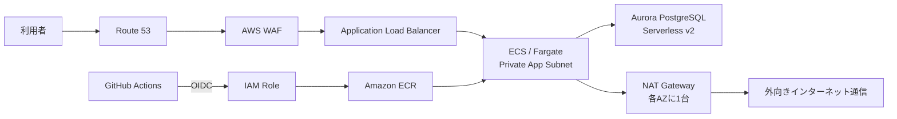

# Terraform AWS Portfolio

就職活動向けのポートフォリオサイトとAWS基盤です。FastAPIアプリケーションをECS/Fargateで実行し、Aurora PostgreSQL Serverless v2、ALB、AWS WAF、Route 53、ACMをTerraformで構築します。

## アーキテクチャ



詳細な設計判断は [docs/architecture.md](docs/architecture.md) を参照してください。

## 5段階の完成状況

| 段階 | 内容 | 成果物 |
|---|---|---|
| 1 | VPC、ALB、ECS/Fargate | `infra/network.tf`、`infra/alb.tf`、`infra/ecs.tf` |
| 2 | GitHub Actions、OIDC、CI/CD | `.github/workflows/`、`infra/iam.tf` |
| 3 | Aurora、Secrets、WAF、監視 | `infra/database.tf`、`infra/waf.tf`、`infra/monitoring.tf` |
| 4 | テスト、障害対応、費用評価 | `infra/tests/`、[Runbook](docs/runbook.md)、[費用試算](docs/cost-estimate.md) |
| 5 | 面接向け3分デモ | [デモ台本](docs/demo-script.md) |

詳細な進捗と、実AWS環境で残っている確認事項は [docs/roadmap.md](docs/roadmap.md) に明記しています。

## 主な特徴

- 2つのAZにまたがるALBとサブネット
- 2つのPrivate App SubnetでPublic IPを持たないECS/Fargate
- 各AZに配置した2台のNAT Gatewayによる外向き通信
- ALBからだけ接続できるECS Security Group
- インターネットから到達できないAurora
- アイドル時に0 ACUへ自動停止するAurora Serverless v2
- Core Rule Set、IP Reputation、レート制限を持つAWS WAF
- Secrets Managerが管理するDBパスワード
- GitHub OIDCによる長期アクセスキー不要のCI/CD
- Pull Requestでのテスト、Terraform検証、Plan
- Mock AWS Providerを使ったTerraform設計ポリシーテスト
- CheckovによるTerraformセキュリティスキャン
- `main`更新時のECR Push、DB Migration、ECS Deployment
- CloudWatch Logs、アラーム、AWS Budgets
- 公開期間終了後にアプリ基盤をまとめて削除可能

## ディレクトリ構成

```text
.
├── app/                 FastAPI、Alembic migration、画面
├── bootstrap/           Terraform State用S3（ローカルState）
├── infra/               ポートフォリオAWS基盤（Remote State）
├── docs/                要件、設計判断、Runbook、費用、デモ台本
├── scripts/             安全確認付きの障害演習スクリプト
├── tests/               FastAPIテスト
├── .github/workflows/   CI、Terraform、アプリデプロイ
├── compose.yaml         ローカル実行環境
└── Dockerfile
```

## 事前準備

次が必要です。

- AWSアカウント
- AWS CLI v2
- Terraform 1.10以上
- Docker
- GitHubアカウント
- お名前.comで登録済みの `aws-demo.blog`

ドメイン登録はTerraformの管理対象に含めません。Public Hosted ZoneとDNS RecordはTerraformで作成し、お名前.comではRoute 53が発行するネームサーバーを設定します。

## 1. AWS CLIへ一時認証する

人が使う長期アクセスキーは作成しません。管理者IAMユーザーのコンソール認証を使い、`aws login`で一時認証情報を取得します。AWS CLI 2.32.0以上が必要です。

```bash
aws login --profile portfolio-admin --region ap-northeast-1
aws sts get-caller-identity --profile portfolio-admin
```

コマンドを実行するとブラウザが開きます。現在使用している管理者IAMユーザーで承認してください。認証情報は自動更新され、長期アクセスキーを`~/.aws/credentials`へ保存する必要はありません。

初回構築には各サービスとIAMを作成できる権限が必要です。構築後のGitHub ActionsはTerraformが作成する専用OIDCロールを使います。複数のAWSアカウントを組織的に管理する段階では、IAM Identity Centerへの移行を検討します。

## 2. State用S3バケットを作る

バケット名は世界で一意にする必要があります。

```bash
cp bootstrap/terraform.tfvars.example bootstrap/terraform.tfvars
# state_bucket_nameを一意な名前へ編集

terraform -chdir=bootstrap init
terraform -chdir=bootstrap plan -out=bootstrap.tfplan -var-file=terraform.tfvars
terraform -chdir=bootstrap apply bootstrap.tfplan
```

`bootstrap/terraform.tfstate` はGitへ登録されません。State用バケットを誤って削除しないよう、bootstrapには削除保護が設定されています。

## 3. AWS基盤を作る

```bash
cp infra/backend.hcl.example infra/backend.hcl
cp infra/terraform.tfvars.example infra/terraform.tfvars
```

次を実際の値へ変更します。

- `infra/backend.hcl` の `bucket`
- `infra/terraform.tfvars` の `state_bucket_name`
- `infra/terraform.tfvars` の `alert_email`
- `infra/terraform.tfvars` のGitHub Owner IDとRepository ID（OIDC immutable subject用）
- `monthly_budget_amount`（初期値60 USDは約1万円を超えにくい安全側の設定）

`backend.hcl` と `terraform.tfvars` は `.gitignore` の対象です。ただし、実行前に `git status` で登録対象になっていないことを必ず確認してください。

最初にRoute 53 Public Hosted Zoneだけを作成します。この初回準備に限り、`-target`を使用します。

```bash
export AWS_PROFILE=portfolio-admin
terraform -chdir=infra init -backend-config=backend.hcl
terraform -chdir=infra plan -target=aws_route53_zone.portfolio -out=dns.tfplan -var-file=terraform.tfvars
terraform -chdir=infra apply dns.tfplan
terraform -chdir=infra output route53_name_servers
```

出力された4つのネームサーバーを、お名前.comの `aws-demo.blog` に設定します。DNSへの反映後、次のコマンドで4つの値が表示されることを確認します。

```bash
dig NS aws-demo.blog +short
```

その後、残りのAWS基盤を作成します。

```bash
export AWS_PROFILE=portfolio-admin
terraform -chdir=infra fmt -check
terraform -chdir=infra validate
terraform -chdir=infra plan -out=tfplan -var-file=terraform.tfvars
terraform -chdir=infra apply tfplan
```

初回のECS Serviceは、存在しないイメージを起動しないようDesired Count 0で作成されます。最初のアプリデプロイが成功すると1へ変更されます。

通知メールにはAWS BudgetsとSNSから確認メールが届きます。SNSメール内の確認リンクを開かない限り、CloudWatchアラームは配信されません。

## 4. ローカルでアプリを確認する

```bash
docker compose up --build
```

次を開きます。

- ポートフォリオ: http://localhost:8000
- API仕様: http://localhost:8000/docs
- ヘルスチェック: http://localhost:8000/health
- 制作物API: http://localhost:8000/api/projects

終了時は次を実行します。DBデータも消す場合だけ `--volumes` を付けます。

```bash
docker compose down
docker compose down --volumes
```

## 5. GitHubリポジトリとCI/CDを設定する

公開リポジトリ `kazukazufx/terraform-aws-portfolio` を作成し、このコードをPushします。AWS基盤のOutputを確認します。

```bash
terraform -chdir=infra output
aws sts get-caller-identity --profile portfolio-admin
```

GitHubリポジトリにEnvironment `dev` を作成し、次を登録します。

| 種類 | 名前 | 値 |
|---|---|---|
| Environment variable | `AWS_ACCOUNT_ID` | AWSアカウントID |
| Environment variable | `AWS_APP_ROLE_ARN` | `github_app_role_arn` Output |
| Environment variable | `AWS_TERRAFORM_ROLE_ARN` | `github_terraform_role_arn` Output |
| Environment variable | `TF_STATE_BUCKET` | bootstrapのS3バケット名 |
| Environment secret | `ALERT_EMAIL` | 通知先メールアドレス |

可能ならEnvironmentのRequired reviewersを設定します。Terraform ApplyはActionsの `Terraform plan and apply` を手動実行し、`apply` を有効にした場合だけ反映されます。

アプリの変更を`main`へ取り込むと、次が自動実行されます。

1. DockerイメージをコミットSHAタグで作る
2. ECRへPushする
3. 新しいECS Task Definitionを登録する
4. Fargateの一時タスクでAlembic migrationを実行する
5. migration成功時だけECS Serviceを更新する
6. ECSが安定するまで待機する

## 6. プロフィールを編集する

[app/content.py](app/content.py) の `PROFILE`、`SKILLS`、`ARCHITECTURE` を編集します。DBの制作物初期値は [app/migrations/versions/20260903_01_create_projects.py](app/migrations/versions/20260903_01_create_projects.py) にあります。

既に適用済みのmigrationは直接書き換えず、次のように新しいmigrationを作成します。

```bash
alembic -c app/alembic.ini revision -m "add another project"
```

## 7. 公開を終了して料金を止める

削除前にPlanを確認します。Aurora内のデータは初期migrationから再作成できる前提のため、最終Snapshotは保存しません。

```bash
export AWS_PROFILE=portfolio-admin
terraform -chdir=infra plan -destroy -out=destroy.tfplan -var-file=terraform.tfvars
terraform -chdir=infra apply destroy.tfplan
```

削除されるものにはALB、WAF、ECS、ECR内のイメージ、Aurora、Secrets ManagerのSecretなどが含まれます。Auroraのデータは復元できません。

次は削除されず、料金や管理が継続します。

- お名前.comで登録した `aws-demo.blog` とその更新料金
- bootstrapのState用S3バケット

Route 53 Public Hosted ZoneとDNS Recordは`infra`と一緒に削除されます。再公開するまでは、お名前.comに設定したネームサーバーが応答しなくなる点に注意してください。

AWSコンソールのBillingとCost Explorerでも、意図したリソースが残っていないか確認してください。

## セキュリティ上の注意

- `.env`、`terraform.tfvars`、State、PlanをGitへ登録しない
- AWSアクセスキーをGitHub Secretsにも保存しない
- GitHub Environmentの承認ルールを有効にする
- WAFは防御の一層であり、アプリ側の入力検証も継続する
- AWS Budgetsは通知であり、利用を自動停止する上限ではない
- `terraform apply` と `destroy` の前にPlanを読む

## テスト

```bash
python -m pip install -r app/requirements-dev.txt
ruff check app tests
python -m pytest
terraform fmt -check -recursive
terraform -chdir=bootstrap init -backend=false
terraform -chdir=bootstrap validate
terraform -chdir=infra init -backend=false
terraform -chdir=infra validate
terraform -chdir=infra test
docker build -t portfolio:test .
```

CheckovはCIで検出結果を可視化します。個人デモ向けの意図的なコスト判断も含むため現時点では情報提供扱いとし、必須の設計ポリシーは `terraform test` で失敗させます。公開前にCheckovの指摘を確認し、対応またはADRへ判断理由を記録してください。

## 設計・運用資料

- [想定要件](docs/requirements.md)
- [アーキテクチャ設計](docs/architecture.md)
- [運用・障害対応Runbook](docs/runbook.md)
- [費用試算と比較案](docs/cost-estimate.md)
- [3分デモ台本](docs/demo-script.md)
- [旧Public ECS構成のADR（置換済み）](docs/adr/0001-cost-optimized-network.md)
- [Private ECSとNAT GatewayのADR](docs/adr/0003-private-ecs-with-nat-gateways.md)
- [安全なデリバリーのADR](docs/adr/0002-safe-delivery.md)
