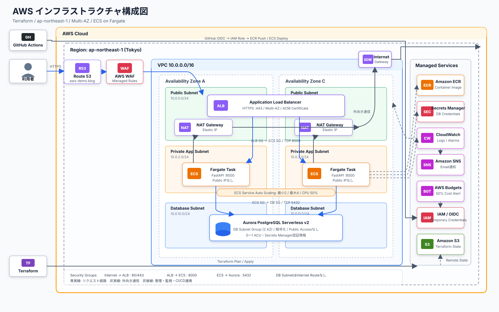
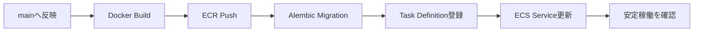

# Terraform AWS Portfolio

FastAPIアプリケーションと、その実行基盤となるAWS環境をTerraformで構築するプロジェクトです。可用性、セキュリティ、継続的デリバリー、運用監視、コスト管理を含む一連のクラウド設計を実装しています。

## アーキテクチャ



[PNG版](docs/architecture-diagram.png) / [diagrams.net（draw.io）編集用ファイル](docs/architecture-diagram.drawio)

システムは東京リージョンの2つのAvailability Zoneにまたがって構成されます。ALBだけをPublic Subnetへ配置し、Fargate TaskとAuroraはPrivate Subnetに配置します。

## 主な設計

### ネットワークと可用性

- ALB、ECS、NAT Gatewayを2つのAvailability Zoneへ分散
- Fargate TaskにPublic IPを割り当てず、インターネットからの直接接続を防止
- 各Availability ZoneにNAT Gatewayを配置し、Private Subnetからの外向き通信を確保
- ECS Service Auto Scalingで2〜4タスクを維持し、平均CPU使用率50%を目標に調整

### セキュリティ

- Security Groupにより、ECSへの通信をALBからのPort 8000だけに制限
- Auroraへの通信をECSからのPort 5432だけに制限
- AWS WAFのManaged RulesとRate-based RuleでWebリクエストを検査
- DB認証情報をSecrets Managerで管理し、Terraformコードやコンテナイメージから分離
- GitHub ActionsはOIDCでAWSの一時認証情報を取得し、長期アクセスキーを不使用
- Terraform Stateを暗号化、バージョニング、Public Access Blockを設定したS3で管理

### アプリケーションとデータベース

- FastAPIによるWeb画面、REST API、ヘルスチェック
- SQLAlchemyとAlembicによるデータアクセスとスキーマ移行
- Aurora PostgreSQL Serverless v2を2 AZに1台ずつ配置し、アイドル時は0 ACUへ自動停止
- Read-only Root Filesystemと非Rootユーザーでコンテナを実行

### CI/CDと品質管理

- Pull RequestでPythonテスト、Lint、Terraform検証、Terraform Planを実行
- Mock AWS Providerを使ったTerraform設計ポリシーテスト
- CheckovによるInfrastructure as Codeのセキュリティスキャン
- `main`更新時にDockerイメージをECRへPushし、DB Migration後にECSへデプロイ
- GitのコミットSHAをイメージタグとアプリケーションバージョンに使用
- ECS Deployment Circuit Breakerによる失敗時の自動ロールバック

### 監視とコスト管理

- CloudWatch LogsとCloudWatch Alarmによるログ・異常監視
- SNSによる通知とAWS Budgetsによる予算アラート
- ECR Lifecycle PolicyとCloudWatch Logsの保持期間を設定
- 利用期間終了後にTerraformでアプリケーション基盤を削除可能

## CI/CDフロー



Migrationが失敗した場合はECS Serviceを更新しません。デプロイ中に新しいTaskが安定しない場合はDeployment Circuit Breakerが直前の正常な構成へ戻します。

## ディレクトリ構成

```text
.
├── app/                 FastAPIアプリケーションとAlembic Migration
├── bootstrap/           Terraform State用S3バケット
├── infra/               AWSアプリケーション基盤
├── docs/                設計、ADR、運用、費用に関する資料
├── scripts/             安全確認付きの障害演習スクリプト
├── tests/               FastAPIの自動テスト
├── .github/workflows/   CI、Terraform Plan/Apply、アプリデプロイ
├── compose.yaml         ローカル開発環境
└── Dockerfile           Fargateで実行するコンテナ定義
```

`bootstrap`と`infra`はTerraform Stateの依存関係を分離しています。State保存先となるS3バケットを`bootstrap`で先に管理し、それ以外のAWSリソースを`infra`のRemote Stateで管理します。

## 技術スタック

| 分類 | 使用技術 |
|---|---|
| Application | Python、FastAPI、SQLAlchemy、Alembic、Jinja2 |
| Container | Docker、Amazon ECR、Amazon ECS on Fargate |
| Database | Amazon Aurora PostgreSQL Serverless v2、Secrets Manager |
| Network | VPC、ALB、NAT Gateway、Route 53、ACM |
| Security | Security Group、AWS WAF、IAM、GitHub OIDC |
| Observability | CloudWatch Logs、CloudWatch Alarm、SNS、AWS Budgets |
| Infrastructure | Terraform、S3 Remote State、Terraform Test、Checkov |
| CI/CD | GitHub Actions |

## 設計・運用資料

- [アーキテクチャ設計](docs/architecture.md)
- [AWS構成図（SVG）](docs/architecture-diagram.svg)
- [AWS構成図（diagrams.net編集用）](docs/architecture-diagram.drawio)
- [想定要件](docs/requirements.md)
- [構築・更新・削除手順](docs/deployment-guide.md)
- [運用・障害対応Runbook](docs/runbook.md)
- [費用試算と比較案](docs/cost-estimate.md)
- [Private ECSとNAT GatewayのADR](docs/adr/0003-private-ecs-with-nat-gateways.md)
- [安全なデリバリーのADR](docs/adr/0002-safe-delivery.md)
- [旧Public ECS構成のADR（置換済み）](docs/adr/0001-cost-optimized-network.md)

## 現在の状態

Terraformコードと自動テストは実装済みです。AWS環境は常時稼働させず、必要な期間だけ構築する運用を想定しています。
